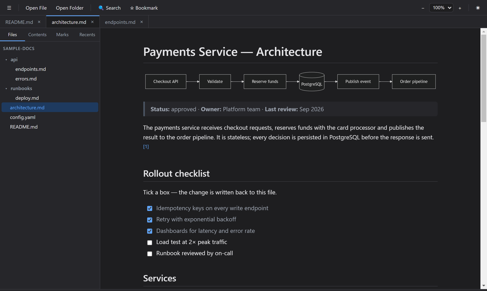

# Markdown Reader

A modern desktop **Markdown reader** built with Electron. Opens `.md` files and documentation folders and renders them with a clean, comfortable reading experience — closer to a document viewer than a code editor.




## Features

- **Markdown rendering** — headings, lists, task lists, tables, blockquotes, footnotes, images, links
- **Interactive task lists** — tick a `- [ ]` checkbox and the change is written straight back to the `.md` file; the status bar tracks how many are done
- **Collapsible sections** — fold a heading to hide everything under it until the next heading of the same level
- **Sortable tables** — click a column header to sort ascending, descending, then back to the document order
- **Syntax highlighting** — code blocks with a Copy button (highlight.js)
- **LaTeX math** — `$inline$` and `$$block$$` via KaTeX
- **Mermaid diagrams** — fenced ` ```mermaid ` blocks render to SVG, lazy-loaded
- **Table of contents** — auto-generated, clickable, tracks the active section as you scroll
- **Multi-tab** — open several documents at once; each tab keeps its own scroll position and zoom
- **Folder tree** — browse a documentation directory from the sidebar
- **In-document search** — match count, next/previous navigation
- **Structured view** — `.json` and `.yaml` open in a collapsible tree with a Tree/Raw toggle
- **Image lightbox** — click any image to enlarge it; zoom, copy or save
- **Bookmarks** — `Ctrl+B` to bookmark a section; persisted across sessions
- **Print / Export PDF** — `Ctrl+P` for a clean print, `Ctrl+Shift+P` to export PDF
- **Zoom** (50–200%) and light / dark / system themes
- **Session restore** — reopens the last folder, tabs and active document
- Relative links between documents (with `#anchors`) and relative images
- File associations — double-click a `.md` file in Explorer to open it

## Getting started

### Prerequisites

- [Node.js](https://nodejs.org/) 18 or later
- npm (bundled with Node.js)

### Run in development

```bash
git clone https://github.com/gb-araujo/markdown-reader.git
cd markdown-reader
npm install
npm run dev
```

Use **File → Open Folder** and pick the `sample-docs/` directory to try it out.

### Run tests

```bash
npm test           # unit tests (Vitest)
npm run typecheck  # TypeScript checks
```

### Build a Windows installer

```bash
npm run package
```

The installer is placed in `dist/`.

## Tech stack

| Layer | Library |
| ----- | ------- |
| Shell | Electron |
| Bundler | electron-vite + Vite |
| UI | React 18 + TypeScript |
| Markdown | markdown-it (CommonMark + tables, footnotes) + an in-house task-list rule |
| Highlighting | highlight.js |
| Math | KaTeX via markdown-it-texmath |
| Diagrams | Mermaid (lazy-loaded) |
| State | Zustand |
| Sanitization | DOMPurify |

### Why Electron?

Markdown rendering is an HTML/CSS problem, and the richest rendering and syntax-highlighting libraries live in the web ecosystem. Electron gives first-class access to them plus native file dialogs, menus, file associations and drag-and-drop, with straightforward Windows packaging.

## Architecture

```
src/
├── shared/          Types + format tables shared across processes
│   └── tasks.ts     Surgical `- [ ]` ↔ `- [x]` source edits (main + renderer)
├── main/            Electron main process
│   ├── index.ts     Window, single-instance, doc-asset protocol, file associations
│   ├── files.ts     Safe file reading (typed errors), folder scanning, task write-back
│   ├── store.ts     Atomic, debounced JSON persistence (userData/state.json)
│   ├── ipc.ts       IPC handlers (dialogs, read, scan, task toggle, state, shell)
│   └── menu.ts      Native application menu → renderer commands
├── preload/         contextBridge API (the only main ↔ renderer surface)
└── renderer/        React app
    ├── core/        Pure, tested logic: markdown, tasklist, fold, tables,
    │                codeview, search, slug, highlight
    ├── components/  Toolbar, TabBar, Sidebar, Viewer, SearchBar, StatusBar…
    └── store.ts     App state: tabs, session, zoom, theme, reading position
```

**Editing:** the reader is read-only except for task checkboxes. A toggle names the source line it came from and the text it expects to find there; the main process re-reads the file, refuses the write if that line no longer matches, and otherwise rewrites just the one checkbox character — indentation, trailing spaces and mixed line endings are left alone.

**Security:** the renderer runs with `contextIsolation` enabled and no Node access. Rendered HTML is sanitized (no scripts, iframes, inline styles or `javascript:` URLs). Local images are served through a dedicated `doc-asset:` protocol restricted to image extensions — the renderer never gets raw `file://` access. External links open in the system browser.

## Testing

Unit tests (Vitest) cover the pure core: slug/anchor generation, Markdown rendering + TOC + sanitization (including Mermaid placeholders and KaTeX math), code-view rendering, in-document search, JSON/YAML structured parsing, format classification, and the main-process file reader/folder scanner (missing, empty, unsupported and directory inputs).

The interactive features are covered end to end in the source: task-line parsing and rewriting (CRLF, BOM, ordered and nested items, stale-line rejection), checkbox rendering and its source-line mapping, the on-disk write path, section folding (including nested folds), and table sorting.

## Roadmap

- **Phase 3:** global folder search, document comparison, distraction-free reading mode, presentation mode, plugin extensibility, PDF support.

## Contributing

Pull requests are welcome. For significant changes, open an issue first to discuss what you would like to change. Please make sure tests pass before submitting.

```bash
npm test
npm run typecheck
```

## License

[MIT](LICENSE)
